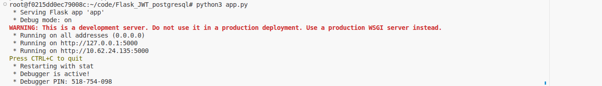
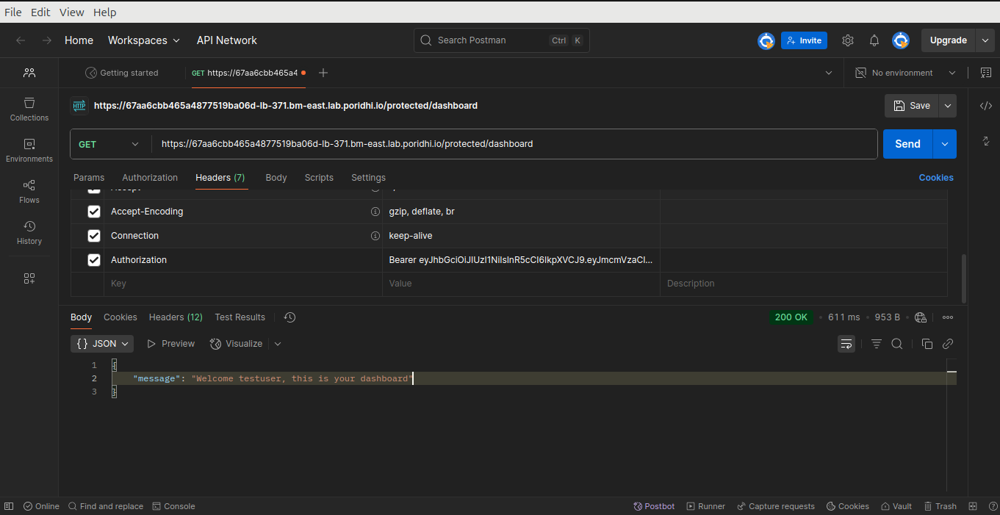
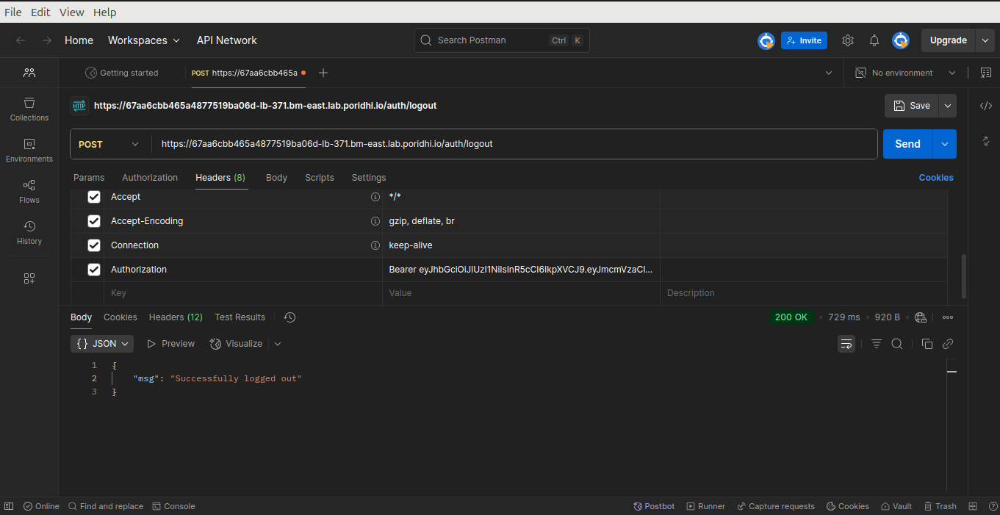

#  Setup Instructions
## 1. Open VS code and launch a terminal on Poridhi`s lab

## 2. Database setup

### Install PostgreSQL
```bash
sudo apt update
sudo apt install postgresql postgresql-contrib libpq-dev build-essential
```
### Active PosrgreSQL Database
```bash
sudo systemctl start postgresql
```
### Access PostgreSQL as the ```postgres``` user:
```bash
sudo -i -u postgres
psql
```
You should now be at the ```postgres=#``` prompt.

### Create your database
```bash
CREATE DATABASE flask_jwt_db;
```
### Create database user
```bash
CREATE USER c WITH PASSWORD 'poridhi1234';
```
### Grant privilage to user
```bash
GRANT ALL PRIVILEGES ON DATABASE flask_jwt_db TO poridhi;
```
### Grant schema-level privilage 
```bash
\c flask_jwt_db; 
GRANT CREATE ON SCHEMA public TO poridhi;
```
- This allows ```poridhi``` to create tables within the ```public``` schema.

### Exit ```psql``` and the ```postgres``` user session:
```bash
\q
exit
```


## 3. Clone the Repository

```bash
git clone https://github.com/wakil86/Flask_JWT_postgresql.git
cd Flask_JWT_postgresql
```


## 4. Update & Install python3 & pip
```bash
sudo apt update
sudo apt install -y python3 python3-pip
```


## 5. Install Python dependencies
```bash
pip install -r requirements.txt
```
## 6. Run the Flask app
```bash
python3 app.py
```
### Press ctrl and click on the link

- Here 5000 is the port which you can change from the ```app.py``` script

### You will be rederected to this webpage


### Copy the link and go to postman app


### Home 
```
GET https://67aa6cbb465a4877519ba06d.bm-southwest.lab.poridhi.io/proxy/5000/
```
### Expected output


###  Registration

```
POST https://67aa6cbb465a4877519ba06d.bm-southwest.lab.poridhi.io/proxy/5000/auth/register
{
  "username": "testuser",
  "password": "testpass1234"
}
```
### Expected output


###  Login

```
POST https://67aa6cbb465a4877519ba06d.bm-southwest.lab.poridhi.io/proxy/5000/auth/login
{
  "username": "testuser",
  "password": "testpass1234"
}
```
### Expected output


###  Protected Route

```
GET https://67aa6cbb465a4877519ba06d.bm-southwest.lab.poridhi.io/proxy/5000/protected/dashboard
Headers:
  Authorization: Bearer <JWT_TOKEN>
```
### Expected output


###  Logout

```
POST https://67aa6cbb465a4877519ba06d.bm-southwest.lab.poridhi.io/proxy/5000/auth/logout
Headers:
  Authorization: Bearer <JWT_TOKEN>
```
### Expected output

---

